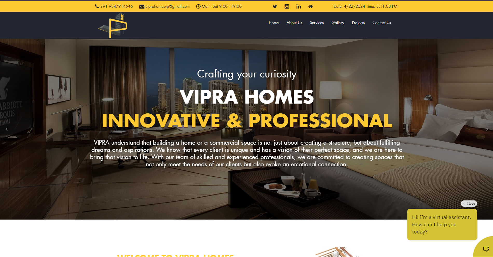

# Project Vipra

Welcome to Project Vipra Homes! This Laravel-based project serves as the digital platform for Vipra, offering a seamless user experience and comprehensive functionalities.

## About

Project Vipra is a Laravel-powered web application designed to streamline operations and enhance user engagement for Vipra. It includes features such as user authentication, content management, and more.

## Features

- User authentication and authorization system
- Content management system for managing various aspects of the platform
- Integration with third-party services for enhanced functionality

## Usage

1. Clone this repository to your local machine.
2. Install the required dependencies using Composer.
3. Set up the database configuration in the `.env` file.
4. Run migrations to set up the database schema:
    ```
    php artisan migrate
    ```
5. Start the development server:
    ```
    php artisan serve
    ```
6. Open your web browser and navigate to `http://localhost:8000` to access the application.

## Contributing

Contributions are welcome! If you have suggestions, bug fixes, or new features to propose, please feel free to open an issue or submit a pull request.

## License

This project is licensed under the [MIT License](LICENSE).

## Contact

For any inquiries or support, please contact us at [ashok93tidke@gmail.com](mailto:ashok93tidke@gmail.com).
